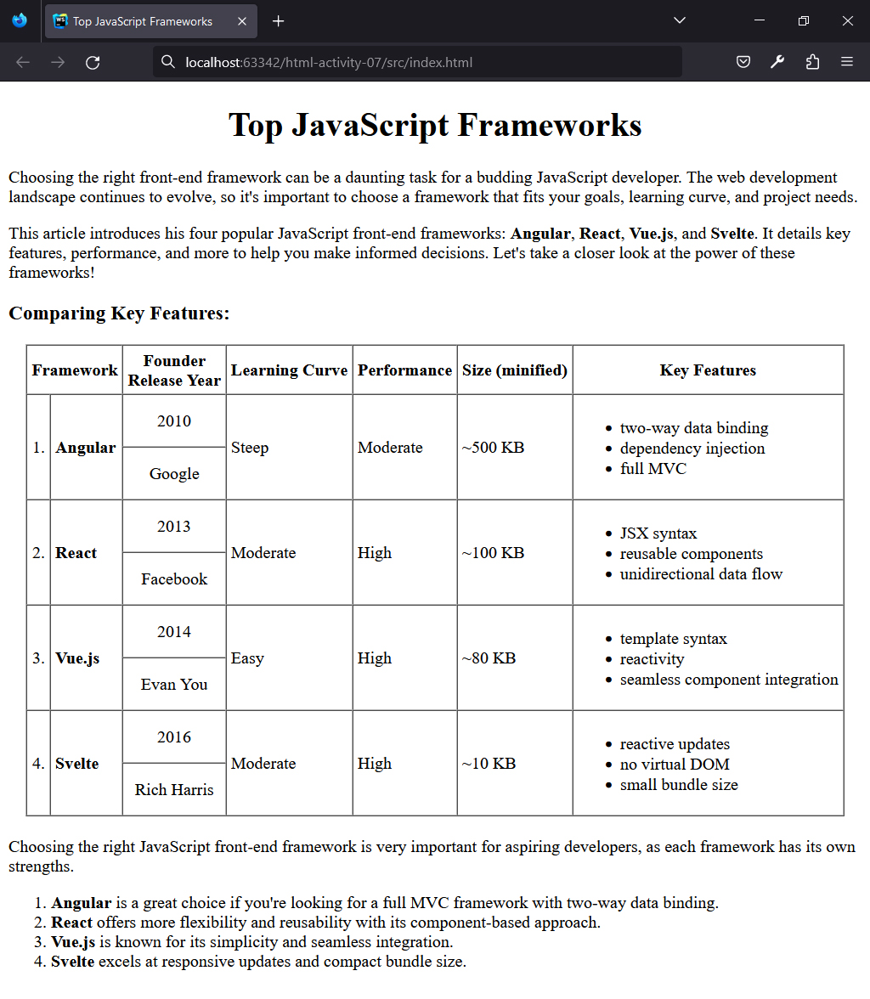

## HTML | Activity #7: Lists and Tables
Create a Web page called **Top JavaScript Frameworks**.


### Required Output
Here is the required output for this activity.
Please ensure that the rows and columns are properly placed and spanned.



You can adjust the table attributes below to display visible borders, without relying on CSS:

```html
<table border="1" cellspacing="0" cellpadding="4">
```


### Development Setup
Create your `index.html` inside the [**src**](/src) folder.

To test your output, simply open any of your html files in your preferred web browser.
